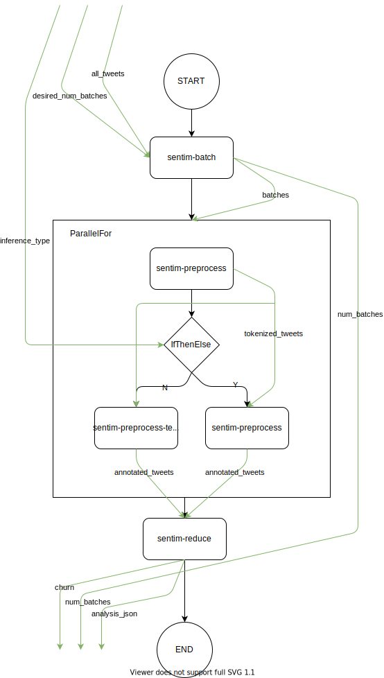

# Sentiment Analysis

This workflow analyzes a large amount of Tweets using a pre-trained TensorFlow Net, or alternatively using NLTK language corpus lookup, to determine sentiment per US state.

## Overview

This repository contains a parallel sentiment analysis implementation, orchestrated with the Abstract Function Choreography Language and runnable on the [Apollo Engine](https://github.com/Apollo-Core)



**Fig 1: workflow.yaml control and data flow**

## Get the code

```bash
git clone https://github.com/Apollo-Workflows/Sentiment-Analysis
cd Sentiment-Analysis
```

## Autodeploy

1. Save the credentials for your cloud provider in the according subfolder:
   - AWS: Go to the service IAM and create a new user with the access type `Programmatic access` and attach the `AdministratorAccess` policy, which is part of the existing policies. You can copy the `Access key ID` and `Secret access key` and put it into the following format and save it under `aws/credentials`:

        ```text
        [default]
        aws_access_key_id = <Your access key ID>
        aws_secret_access_key = <Your secret access key>
        ```

   - IBM: Create the `ibmcloud_api_key` [here](https://cloud.ibm.com/iam/apikeys) add it to `ibm/terraform.tfvars`
2.
   - A: Deploy to all providers:
        Run from root dir `docker run --rm -it --entrypoint=/app/deployAll.sh -v ${PWD}:/app/ chrisengelhardt/apollo-autodeploy`
   - B: Deploy single provider with custom settings:
        Run `docker run --rm -v ${PWD}:/app/ chrisengelhardt/apollo-autodeploy --help` from within the directory of your chosen cloud provider

Note: For IBM you have to create a namespace first and place it into `ibm.tf` at line `namespace = "YOURNAMESPACE"`.

```text
Usage: /app/deploy.sh [--help] [--region region] [--url] [--mapping]

Commands:
        --help                  Show this help output.
        --region region         Sets a specific region for the deployment. Use a region from:
                                https://docs.aws.amazon.com/AmazonRDS/latest/UserGuide/Concepts.RegionsAndAvailabilityZones.html
        --url                   Prints out all deployment urls
        --mappings              Creates typeMapping.json with the deployment urls
```

## Build for OpenFaaS

**Make sure** that [faas-cli](https://github.com/openfaas/faas-cli) and Docker are installed and available.
Adjust the file `openfaas/stack.yml` to include a docker account prefix instead of the *<prefix>* placeholder and make sure you can push images from your system using that prefix.

Build and publish the function images by running the provided script in the `openfaas` directory:

```bash
cd ./openfaas
./build.sh --publish
```

Using the `-f` or `--file` flag, a filename can be supplied to match only a single `.y*ml` file describing functions (passing `-f stack` would search the directory using `stack.y*ml`).
All files matching `*.y*ml` are used per default to find function descriptions. The `-p` or `--publish` flag can be supplied to also push the built functions to a container registry.

Use the `faas-cli` to deploy functions to a host. Before you can issue the commands below, follow the instructions of [faas-cli](https://github.com/openfaas/faas-cli) on how to log in to a host. After a successful login, the functions can be deployed by running

```bash
cd ./openfaas
faas-cli deploy -f stack.yml --gateway http://<address of host>:8080
```

## References

**Twitter data set**: [Z. Cheng, J. Caverlee, and K. Lee. You Are Where You Tweet: A Content-Based Approach to Geo-locating Twitter Users. In Proceeding of the 19th ACM Conference on Information and Knowledge Management (CIKM), Toronto, Oct 2010](https://archive.org/details/twitter_cikm_2010) (Accessed Dec 14 2020)

**TensorFlow Text classification model (used in `sentim-inference`):** [Text classification | TensorFlow Lite](https://www.tensorflow.org/lite/models/text_classification/overview) (Accessed Dec 22 2020)

**Textblob Library & NLTK corpora (used in `sentim-inference-textblob`)**: [sloria/TextBlob | GitHub](https://github.com/sloria/textblob) (Accessed Dec 25 2020)
